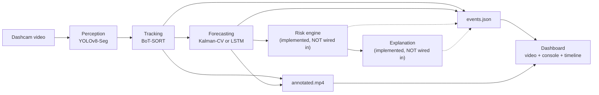
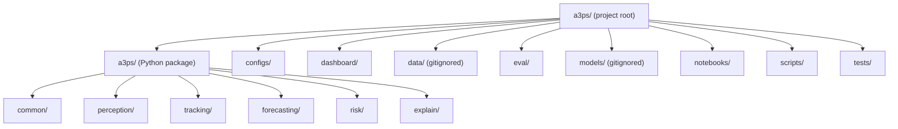
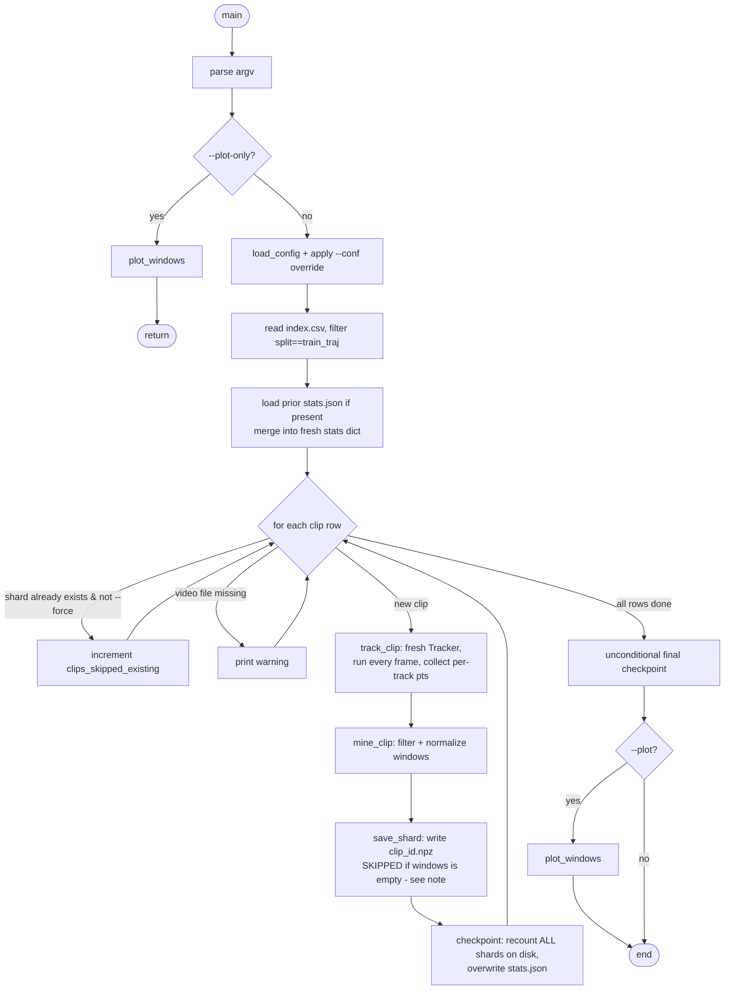
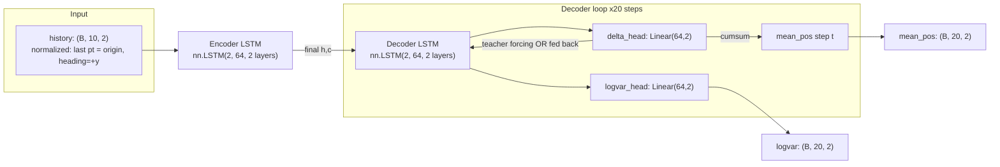
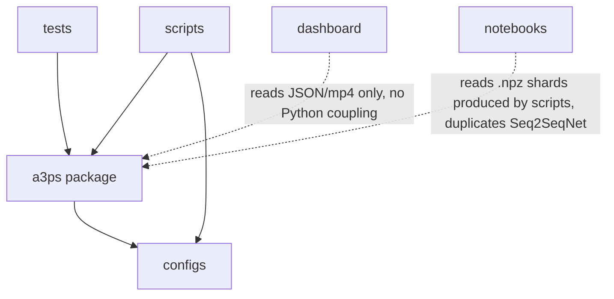
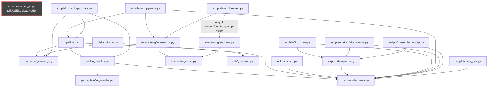

# A3PS — Master Project Explanation

**Purpose of this document:** you (the original author, months later, having
forgotten details) or a new contributor should be able to read this file
top-to-bottom and understand the entire project — every folder, every file,
every function's role, every design decision, every known problem — without
opening the source code first.

**Accuracy note:** every claim below was verified by directly reading the
actual files in this repository (`c:\Users\Sayali.bambal\Downloads\A3PS-Project\a3ps`)
during the writing of this document, and by grepping the codebase for real
cross-module imports rather than relying on memory. Where something was
*reported in chat during development* but could not be verified as present in
this repository checkout, that distinction is called out explicitly — this
matters, because several such gaps were found (see §13, Known Issues).

---

## 1. Project Overview

### 1.1 Goal
A3PS ("Agentic Accident Anticipation & Prevention System" — see the dashboard
title in `dashboard/index.html`, or "Anticipatory Traffic-Safety Pipeline" per
`README.md`) turns a dashcam video into:
1. An **annotated video** (`annotated.mp4`) with detected/tracked road actors,
   their predicted future paths, and risk-colored overlays.
2. A **structured JSON file** (`events.json`) — the single canonical record of
   everything the pipeline observed and predicted for that clip.
3. (Eventually) **explained safety events** — ALERT / VIRTUAL_BRAKE
   interventions with a human-readable reason.

### 1.2 Problem statement
Reactive driver-assistance systems typically only respond once a hazard is
already close (a proximity threshold is crossed). A3PS's thesis is that
**trajectory forecasting lets the system warn earlier** than that — by
predicting where a pedestrian, cyclist, or vehicle is *going* before it
physically enters the danger zone, rather than reacting to where it *is now*.

### 1.3 Motivation
The Nexar dashcam dataset contains real collision and near-collision clips.
If the system can compute a short-horizon trajectory forecast a few seconds
ahead and compare it against the ego vehicle's driving corridor, it can raise
an earlier, better-explained warning than a system that only checks current
distance/overlap.

### 1.4 High-level architecture



Solid arrows are live/working today. Dashed arrows (risk → explain →
events.json) represent the code path that exists and is unit-tested in
isolation, but is **not yet connected** to the live pipeline — see §5 and §13.

### 1.5 Technologies used
- **Language:** Python 3 (developed against both Python 3.11 and 3.14
  interpreters at different points — see `.venv` notes in §8) and vanilla
  JavaScript/HTML/CSS for the dashboard (no frontend framework/build step).
- **Computer vision / ML:** Ultralytics YOLOv8-Seg (detection + segmentation),
  Ultralytics BoT-SORT (multi-object tracking), PyTorch (LSTM forecaster),
  `filterpy` (Kalman filter), OpenCV (video I/O, geometry, drawing).
- **Data:** `openpyxl` (Excel label parsing), `numpy`, `scipy`.
- **Explanation (stretch):** Anthropic Claude API (`anthropic` Python SDK).
- **Dashboard:** static HTML5 `<video>` + `<canvas>` overlay, no build
  tooling, served via Python's built-in `http.server`.
- **Testing:** `pytest`.

### 1.6 Libraries used (from `requirements.txt`, verified current)
```
numpy, opencv-python, pyyaml, openpyxl,
ultralytics, torch, torchvision,
filterpy, scipy,
matplotlib,
anthropic, httpx,
pytest
```

### 1.7 Overall pipeline (one line)
`video → detect+segment → track → forecast → [risk → explain] → render + JSON → dashboard`

---

## 2. Overall Project Flow

There are actually **two distinct top-level flows** in this project, and it's
important not to conflate them:

### 2.1 Flow A — the live per-clip pipeline (inference)
```
Video file
  ↓
scripts/run_pipeline.py (CLI entry point)
  ↓
a3ps/pipeline.py :: Pipeline.run()
  ↓  (per frame, in a loop)
Tracker.update()          — detect + track + decimate history
  ↓
Pipeline._fill_bev()      — project centroid/velocity to BEV metres
  ↓
forecaster hook           — Kalman-CV predicts future path + std
  ↓
risk_engine hook          — NOT WIRED (always None today)
  ↓
explainer hook            — NOT WIRED (always None today)
  ↓
Pipeline._draw_frame()    — render masks/trails/predictions/corridor
  ↓  (after all frames)
ClipResult.save_json()    — events.json
  +  raw.mp4 copy, meta.json, annotated.mp4
  ↓
dashboard/ (reads events.json + raw.mp4, renders in-browser)
```

### 2.2 Flow B — offline dataset preparation + trajectory mining + training
```
Nexar dataset (videos/ + labels.xlsx)
  ↓
scripts/prepare_nexar.py     — index + split (dev/eval/train_traj)
  ↓
data/nexar/index.csv          (master table)
  ↓
scripts/mine_trajectories.py  — track train_traj clips, extract+filter+normalize windows
  ↓
data/trajectories/*.npz + stats.json + windows_preview.png
  ↓
notebooks/train_forecaster.ipynb  — train Seq2SeqNet (LSTM)
  ↓
models/seq2seq_v1.pt
  ↓
scripts/eval_forecast.py      — ADE/FDE: Kalman-CV vs Seq2Seq-LSTM
  ↓
eval/forecast_table.md
```

These two flows share code (`Tracker`, `KalmanCVForecaster`, the `configs/`)
but are otherwise independent — Flow B never touches `Pipeline` or the
dashboard; it exists purely to produce and evaluate a forecaster.

---

## 3. Folder-by-Folder Explanation

The project has two nested `a3ps` directories — this trips people up, so be
explicit about it:

```
A3PS-Project/                <- outer git repo root (also has .git/)
└── a3ps/                    <- the actual project ("project root" below)
    ├── a3ps/                <- the Python PACKAGE (import a3ps.foo)
    ├── configs/
    ├── dashboard/
    ├── data/                <- gitignored
    ├── eval/
    ├── models/              <- gitignored; does not exist on this checkout
    ├── notebooks/
    ├── scripts/
    └── tests/
```

All paths below are relative to the **project root**
(`A3PS-Project/a3ps/`), not the outer git repo root.



### `a3ps/a3ps/` — the Python package
**Why it exists:** this is the actual importable library
(`import a3ps.common.schema`, etc.). Everything reusable lives here; nothing
in `scripts/` should contain real logic that another script might need —
logic belongs here, CLI wiring belongs in `scripts/`.

**Sub-packages:**
- `common/` — the shared data schema (`schema.py`), geometry/BEV math
  (`geometry.py`), and an unused video I/O helper (`video_io.py` — see §13).
  Everything else in the package depends on `common/`.
- `perception/` — `segmenter.py`, the YOLOv8-Seg wrapper. Depended on by
  `tracking/` (for `simplify_polygon`).
- `tracking/` — `tracker.py`: `Tracker` (BoT-SORT wrapper) and
  `TrajectoryBuffer` (5 Hz history buffer). Depends on `common/` and
  `perception/`.
- `forecasting/` — `base.py` (the `Forecaster` interface), `kalman_cv.py`
  (CORE forecaster), `seq2seq.py` (STRETCH, LSTM forecaster). `kalman_cv.py`
  and `seq2seq.py` both depend only on `base.py` — they do **not** depend on
  each other, and neither depends on `tracking/` or `perception/`. This is
  deliberate: a forecaster only needs a list of `[x, y]` points, not
  knowledge of how they were tracked.
- `risk/` — `gaussian.py` (per-step Gaussian), `collision.py` (collision
  probability math), `decision.py` (`DecisionEngine`, thresholds → `Event`).
  Depends on `common/`. **Not imported by `pipeline.py`** — see §13.
- `explain/` — `templates.py` (deterministic explanation strings),
  `llm_client.py` (Anthropic API enrichment). Depends on `common/`.
  **Not imported by `pipeline.py`** — see §13.
- `pipeline.py` (top level of the package) — the orchestrator, `Pipeline`
  class. Depends on `common/` and `tracking/` directly; `forecasting/`,
  `risk/`, `explain/` are injected as optional callables from the outside
  (see §12, Design Decisions) rather than imported directly.

**Who imports from this package:** every file in `scripts/` and `tests/`.

### `configs/`
**Why it exists:** all tunable pipeline parameters (model names, thresholds,
geometry) live here as YAML, not hardcoded in Python, so behavior can change
without editing code.
**Contains:** `default.yaml` (the master config), `botsort_a3ps.yaml` (a
custom BoT-SORT tracker config — see §8 and §13 for why it exists).
**Interacts with:** `a3ps/pipeline.py::load_config()`, and is read by nearly
every script (`run_pipeline.py`, `mine_trajectories.py`, the `__main__` demos
in `segmenter.py`/`tracker.py`).

### `dashboard/`
**Why it exists:** a zero-build-step, static web UI to visualize a clip's
`events.json` — video + canvas overlay + agent console + risk timeline. Kept
deliberately framework-free so it has no dependency on Node/npm.
**Contains:** `index.html`, `app.js`, `style.css`, and `clips/` (per-clip
output directories + `manifest.json` listing which clip ids to show in the
dropdown).
**Interacts with:** reads `dashboard/clips/<id>/events.json` and
`dashboard/clips/<id>/raw.mp4` (or `annotated.mp4` if present) — see §6.
Served by `scripts/serve_dashboard.py`. **Does not interact with any Python
code at runtime** — it's a pure client-side static site.

### `data/` (gitignored — see `.gitignore`, verified)
**Why it exists:** holds the real Nexar dataset and derived
mining/preparation outputs. Gitignored because it's large and
machine-specific (30GB+ full dataset).
**Sub-structure (as designed and used):**
- `data/nexar/videos/` — flat pool of source `.mp4` clips, named by id.
- `data/nexar/labels.xlsx` — the Excel label table (`id, time_of_event,
  time_of_alert, target`).
- `data/nexar/index.csv` — generated master index (see §4,
  `scripts/prepare_nexar.py`).
- `data/dev_clips/` — the 15 shortest dev clips, copied/renamed
  `dev01.mp4`..`dev15.mp4`, + a `README.md` mapping them back to original ids.
- `data/trajectories/` — mined `.npz` shards + `stats.json` +
  `windows_preview.png` (see §4, `scripts/mine_trajectories.py`). **On this
  specific checkout, this folder currently only contains `1875.npz` +
  `stats.json` from an early single-clip smoke test** — the full 93-clip
  mining run described in §11 happened on a separate GPU machine and its
  outputs have not been copied into this checkout (verified by directly
  listing this folder — see §13).

### `eval/`
**Why it exists:** output directory for `scripts/eval_forecast.py`'s
Kalman-vs-LSTM comparison table.
**Contains:** `forecast_table.md`. **Verified content on this checkout is
STALE** — it holds a tiny 2-window smoke-test result (Kalman-CV only,
4.93/6.83/... px), not the real 172-window GPU result reported in
development chat (15.24/23.59/.../51.24/102.00 px) — that real result was
never written back into this file on this machine. See §13.

### `models/` (gitignored, does not exist on this checkout)
**Why it exists (intended):** holds trained forecaster weights,
`seq2seq_v1.pt`, produced by `notebooks/train_forecaster.ipynb` and consumed
by `scripts/eval_forecast.py` and `a3ps/forecasting/seq2seq.py`. **Verified:
this directory does not exist at all on this checkout** — the trained model
(best val ADE 51.642, per chat) lives only on the GPU machine where training
ran, and per `GPU_HANDOFF.md`'s own instructions it should be copied back but
apparently has not been (yet) on this machine.

### `notebooks/`
**Why it exists:** holds the one Colab/Jupyter training notebook,
`train_forecaster.ipynb`. Kept separate from `scripts/` because it's meant to
be run interactively (with visual output — loss curves, sample predictions),
not from the CLI.

### `scripts/`
**Why it exists:** every CLI entry point lives here — thin wrappers around
the `a3ps` package that parse arguments and call into real logic. See §9 for
a per-script breakdown.

### `tests/`
**Why it exists:** `pytest`-based unit tests, one file per module being
tested, plus `tests/fixtures/` for static test data (`events_example.json`,
the canonical `events.json` shape used to hold the schema to a spec).
**Currently 38 tests, all passing** (verified by running `pytest -q` while
writing this document).

---

## 4. File-by-File Explanation

This section covers every substantive file. Trivial `__init__.py` files
(all one-line docstrings, verified) are omitted from detailed treatment;
their content is a single descriptive docstring naming the sub-package's
purpose, nothing more.

### `a3ps/a3ps/common/schema.py`
**Why it exists:** the single shared data contract every other module reads
and writes. This is the most important file in the project — get this wrong
and everything downstream breaks.
**Classes (all `@dataclass`, each with `to_dict()`/`from_dict()`):**
- `Prediction` — one forecast: `horizon_s, dt, mean_img, mean_bev, std_bev,
  collision_prob, ttc_s`. `mean_bev`/`std_bev` are `Optional` and serialize as
  JSON `null` when absent (verified by `test_bev_none_serializes_as_null`).
- `TrackState` — one tracked actor at one frame: `id, cls, bbox,
  centroid_img, centroid_bev, velocity_bev, mask_poly, history_img,
  prediction, risk_level` (default `"safe"`).
- `FrameRecord` — one frame: `frame_idx, t, tracks: List[TrackState], ego,
  context`.
- `Event` — one alert: `event_id: int, frame_idx, t, type, actor_id,
  actor_cls, collision_prob, threshold, ttc_s, explanation_template,
  explanation_llm`.
- `ClipResult` — the top-level container: `meta, frames: List[FrameRecord],
  events: List[Event]`, with `save_json(path)` / `load_json(path)`.
**Inputs:** none (pure data classes). **Outputs:** JSON via `save_json`.
**Called by:** literally every other module in the package and every script.
**Global state / config:** none — this file has no side effects.

### `a3ps/a3ps/common/geometry.py`
**Why it exists:** pure geometry helpers (no ML), plus the `GroundPlane` BEV
projection class.
**Functions:** `iou(a, b)`, `bbox_centroid(b)`, `point_in_polygon(pt, poly)`
(ray-casting), `estimate_homography`/`apply_homography` (thin cv2 wrappers,
**not actually called anywhere else in the codebase** — `GroundPlane` does
its own homography internally instead; these two functions appear to be
unused utility functions kept for potential external use), `ego_corridor(...)`
(returns a rectangular BEV polygon — used only by tests, not by the live
pipeline, which builds its corridor from `configs/default.yaml`'s
`ego_corridor` fractions instead via `Pipeline._ego_corridor`).
**Class `GroundPlane`:** homography-based image↔BEV mapping.
  - `__init__(image_points, ground_points)` — builds both directions via
    `cv2.getPerspectiveTransform`.
  - `from_config(config, width, height, override=None)` — classmethod;
    scales `DEFAULT_GROUND_PLANE` (or the config's `ground_plane` block, or a
    per-clip `override`) by the frame's actual pixel dimensions.
  - `img_to_bev(points)` / `bev_to_img(points)` — the two projection
    directions.
**Function `load_ground_override(path)`:** loads an optional per-clip YAML/JSON
ground-plane override; returns `None` if the path is falsy or the file
doesn't exist.
**Called by:** `pipeline.py` (`GroundPlane.from_config`, `load_ground_override`),
`scripts/mine_trajectories.py` (`GroundPlane`, when BEV mode is active),
`scripts/verify_bev.py` indirectly (via `ClipResult` output it inspects),
`tests/test_geometry.py`.

### `a3ps/a3ps/common/video_io.py`
**Why it exists (intended):** thin `cv2.VideoCapture`/`cv2.VideoWriter`
wrappers (`VideoReader`, `VideoWriter`) as context managers, presumably meant
to standardize video I/O across the project.
**Actual status: dead code.** Verified via `grep -rn "video_io\|VideoReader\|
VideoWriter"` across the whole repo — nothing outside this file itself
imports or instantiates `VideoReader`/`VideoWriter`. Every place that needs
video I/O (`segmenter.py`, `tracker.py`, `pipeline.py`, `mine_trajectories.py`,
`prepare_nexar.py`) calls `cv2.VideoCapture`/`cv2.VideoWriter` directly
instead. See §13.

### `a3ps/a3ps/perception/segmenter.py`
**Why it exists:** wraps Ultralytics YOLOv8-Seg for one-shot, non-tracked
detection+segmentation (used standalone via its `__main__` demo, and its
`simplify_polygon` function is reused by `tracker.py`).
**Module-level:** `CONFIG_DEFAULTS` dict (model_name, conf, img_size, classes,
mask_poly_max_points). `simplify_polygon(poly, max_points)` — reduces a mask
polygon to ≤ `max_points` via iterative `cv2.approxPolyDP` epsilon growth
(up to 50 iterations); shared with `tracker.py` so both produce consistent
mask shapes.
**Class `Segmenter`:**
  - `__init__(config)` — merges `config` over `CONFIG_DEFAULTS`, loads the
    YOLO model, auto-detects CUDA (`torch.cuda.is_available()`) and switches
    to `.to("cuda").half()` if present, maps configured class *names* to the
    model's class *ids*.
  - `segment(frame) -> list[dict]` — runs `model.predict(...)` on one BGR
    frame; returns `[{cls, conf, bbox, mask_poly}, ...]`. Explicitly does
    **not** pass a `half=True` kwarg to `predict()` — a comment in the code
    explains this was removed because the model is already `.half()`'d once
    at load time, and passing it again per-call triggered an Ultralytics
    deprecation warning on every single frame (a real bug found and fixed
    during development — see §13).
**`__main__` demo:** `python -m a3ps.perception.segmenter <video>` — runs on
every 5th frame, draws translucent masks + labels, writes
`perception_preview.mp4` (found at the project root — verified present),
prints mean inference ms/frame.
**Called by:** `a3ps/tracking/tracker.py` (imports `simplify_polygon` only —
`Segmenter` the class is **not** used by the tracker; see next entry for why).

### `a3ps/a3ps/tracking/tracker.py`
**Why it exists:** BoT-SORT-based multi-object tracking. Deliberately does
**not** also run `Segmenter` — a comment explains that Ultralytics' tracking
mode (`model.track(...)`) already returns segmentation masks, so running a
separate `Segmenter` pass would double the inference cost for no benefit.
**Class `TrajectoryBuffer`:** per-track rolling history, decimated to
`predict_hz` (default 5 Hz).
  - `push(frame_idx, t, tracks)` — bins each track's centroid into a
    `1/predict_hz`-second bucket, keeping only the first sample per bucket
    (this is what decimates a 30fps stream to ~5Hz), then prunes.
  - `_prune(now)` — drops any track id not seen for more than `STALE_S = 1.0`
    seconds (module-level constant).
  - `history(track_id)` — the buffered points, most recent last.
  - `ready(track_id) -> bool` — `True` once ≥ 80% of the target window size
    exists (`history_s * predict_hz * 0.8`).
**Class `Tracker`:**
  - `__init__(config)` — loads **exactly one** YOLO model instance, same
    CUDA/half auto-detection as `Segmenter`, builds a `TrajectoryBuffer`.
  - `_foot_point(bbox)` — static method; returns the bottom-center of a bbox
    (the object's ground-contact point — used as `centroid_img` everywhere).
  - `update(frame, frame_idx, t) -> list[TrackState]` — calls
    `model.track(..., persist=True, tracker=self.tracker_cfg)`, builds one
    `TrackState` per tracked box (leaving `centroid_bev`, `velocity_bev`,
    `prediction` as `None` — those are filled by later pipeline stages), then
    feeds the frame's tracks into `self.buffer` and fills each
    `TrackState.history_img` from it.
**Module constants:** `CONFIG_DEFAULTS`, `STALE_S = 1.0`.
**`__main__` demo:** `python -m a3ps.tracking.tracker <video>` — writes
`tracking_preview.mp4` (verified present at project root) with per-track-ID
colored masks + `"cls ID"` labels.
**Called by:** `a3ps/pipeline.py` (`Tracker`), `scripts/mine_trajectories.py`
(`Tracker`, imported locally inside `track_clip`), `tests/test_tracking_buffer.py`
(`TrajectoryBuffer`, `STALE_S`).

### `a3ps/a3ps/forecasting/base.py`
**Why it exists:** the `Forecaster` abstract-base-class interface, so
`KalmanCVForecaster` and `Seq2SeqForecaster` are interchangeable.
**Interface:** `predict(history: List[[x,y]], dt: float, horizon_s: float) ->
(means, stds)`. `means` is a list of future `[x,y]` points at `dt` spacing;
`stds` is the matching list of `[sx, sy]`.
**Called by:** both concrete forecasters (they subclass `Forecaster`), and
imported (`Means`, `Point`, `Stds` type aliases) by both.

### `a3ps/a3ps/forecasting/kalman_cv.py`
**Why it exists:** the CORE, no-training-required forecaster.
**Class `KalmanCVForecaster(Forecaster)`:** constant-velocity Kalman filter,
state `[x, y, vx, vy]`, built on `filterpy.kalman.KalmanFilter`.
  - Module constants: `FALLBACK_STD = 40.0`, `MEAS_VAR = 1.0`,
    `PROCESS_VAR = 0.1`, `MIN_HISTORY = 4`.
  - `_Q(dt, var)` — static method building the process-noise matrix
    (white-acceleration model coupling position and velocity per axis).
  - `_straight_line(history, dt, n_steps)` — fallback used when history has
    fewer than `MIN_HISTORY` (4) points: extrapolates the last two points
    linearly, with a large fixed std (`FALLBACK_STD`).
  - `predict(history, dt, horizon_s)` — the main method. Initializes the
    filter state from the first two history points, runs `predict()`+
    `update()` over the remaining history points (the "fit" phase), then
    rolls `predict()` forward `n_steps` times **without** further `update()`
    calls (the "forecast" phase) — this is what makes the reported
    uncertainty grow over the horizon. Reports
    `sqrt(diag(H P Hᵀ + R))` (the *predicted measurement* covariance,
    including the measurement-noise floor `R`) rather than the raw state
    covariance `P` — a deliberate tuning decision, see §12.
**Called by:** `scripts/run_pipeline.py` (`make_forecaster_hook`),
`scripts/eval_forecast.py`, `tests/test_forecasting.py`.

### `a3ps/a3ps/forecasting/seq2seq.py`
**Why it exists:** the STRETCH, learned forecaster.
**Module constants:** `HIST = 10`, `FUT = 20`, `HIDDEN = 64`, `LAYERS = 2`.
**Class `Seq2SeqNet(nn.Module)`:** encoder LSTM (`nn.LSTM(2, 64, 2,
batch_first=True)`) over the 10-point history, feeding its final hidden/cell
state into a decoder LSTM (same shape) that runs step-by-step for `FUT=20`
steps, each step producing a `delta_head` (position delta) and a
`logvar_head` (log-variance) via two `nn.Linear(64, 2)` heads. Supports
teacher forcing via an optional `target_deltas` argument (used only during
training).
**Function `future_to_deltas(future)`:** converts absolute future positions
(relative to the window origin) into per-step deltas — used both for teacher
forcing and as the Gaussian-NLL target.
**Function `gaussian_nll(mean_pos, logvar, target_pos)`:** the training loss
— per-step diagonal Gaussian negative log-likelihood, summed over x/y then
averaged over the batch.
**Class `Seq2SeqForecaster(Forecaster)`:** the inference wrapper.
  - `save(path)` / `load(path)` — persist/restore `{state_dict, hidden,
    layers}`.
  - `_normalize(history)` — static method; **replicates the exact
    normalization used during mining** (translate to last-history origin,
    rotate mean heading to +y) so a trained model sees inputs in the same
    frame it was trained on.
  - `predict(history, dt, horizon_s)` — pads/truncates history to exactly
    `HIST=10` points (left-padding with a repeated first point if shorter),
    normalizes, runs the network, de-normalizes the output positions
    (`pos_norm @ R + origin`) and rotates the per-step diagonal covariance
    back to the original frame.
**Called by:** `scripts/eval_forecast.py` (only if `models/seq2seq_v1.pt`
exists), `notebooks/train_forecaster.ipynb` (a **separate, hand-duplicated**
copy of `Seq2SeqNet`/`future_to_deltas`/`gaussian_nll` lives inline in the
notebook so it's Colab-portable — see §13 for the duplication risk this
creates).

### `a3ps/a3ps/risk/gaussian.py`
**Why it exists:** converts a forecast's `(means, stds)` into a list of
per-step 2D Gaussians for the collision-probability math to consume.
**Class `GaussianStep`:** `__slots__ = ("mean", "cov")` — a lightweight
mean+2x2-covariance pair.
**Function `gaussians_from_std(means, stds)`:** builds diagonal-covariance
`GaussianStep`s (`cov = diag(sx², sy²)`) from parallel `means`/`stds` lists.
**Called by:** `a3ps/risk/collision.py` (imports `GaussianStep`),
`tests/test_collision.py`. **Not called by `pipeline.py`** — see §13.

### `a3ps/a3ps/risk/collision.py`
**Why it exists:** the actual collision-probability math.
**Function `_phi(z)`:** standard normal CDF via `math.erf`.
**Function `prob_in_axis_box(mean, std, box)`:** exact analytic probability
mass of a diagonal Gaussian inside an axis-aligned rectangle (product of two
1D normal-CDF differences) — easy to hand-verify, used for unit tests.
**Function `sigma_points(mean, cov, kappa=1.0)`:** returns 5 (2n+1 for n=2)
weighted sigma points for a 2D unscented transform, via a closed-form
Cholesky-free 2×2 matrix square root.
**Function `sigma_point_collision_prob(g, corridor_poly, kappa=1.0)`:**
estimates `P(actor inside corridor)` by summing the weights of sigma points
that land inside the polygon (`point_in_polygon`, from `common/geometry.py`)
— this is the general-purpose estimator, working for arbitrary polygons and
full (non-diagonal) covariances, unlike `prob_in_axis_box`.
**Function `ttc_seconds(distance_m, closing_speed_mps)`:** simple
time-to-collision; returns `inf` if not closing (`closing_speed_mps <= 0`).
**Called by:** `tests/test_collision.py` only — **not called by
`pipeline.py`** — see §13.

### `a3ps/a3ps/risk/decision.py`
**Why it exists:** the threshold/decision layer that would turn a
`collision_prob` into a real `Event`.
**Class `DecisionEngine`:**
  - `__init__(base_threshold=0.75, caution_threshold=0.4)`.
  - `_effective_threshold(context)` — lowers `base_threshold` by 0.1 if
    `context.get("raining")`, by a further 0.05 if `context.get("night")`,
    floored at `caution_threshold`.
  - `classify(prob, context)` — returns `"danger"` / `"caution"` / `"safe"`.
  - `evaluate(track, frame_idx, t, context=None) -> Optional[Event]` — sets
    `track.risk_level` from `classify(...)`; if not `"danger"`, returns
    `None`. Otherwise builds an `Event` with `type` = `"VIRTUAL_BRAKE"` if
    the actor's class is `"person"`, else `"ALERT"`.
  - **Known dead-code branch:** the line `if lowered and level == "caution":
    event_type = "THRESHOLD_LOWERED"` can never execute — the function
    already returned `None` earlier if `level != "danger"`, so by the time
    this line runs `level` is guaranteed to be `"danger"`, never
    `"caution"`. This means the `"THRESHOLD_LOWERED"` event type (which
    `a3ps/explain/templates.py` and the dashboard both have handling for) is
    **never actually produced** by this code as written. See §13.
**Called by:** nothing outside itself yet — no test file exercises
`DecisionEngine` directly (verified: no `decision` import in any `tests/*.py`
file), and `pipeline.py` does not import it. It exists, is presumably
correct in its core logic, but is entirely unexercised in this codebase
today except by manual reasoning.

### `a3ps/a3ps/explain/templates.py`
**Why it exists:** deterministic (no-LLM-call) explanation strings for an
`Event`.
**Module dicts:** `_ACTION` (event type → verb phrase, e.g.
`"VIRTUAL_BRAKE" → "Virtual braking"`), `_FLAG_REASON` (context flag → human
phrase, e.g. `"crosswalk_ahead" → "crosswalk ahead"`).
**Function `_reason_clause(context)`:** builds the trailing `" due to X, Y"`
clause from `context["flags"]`.
**Function `explain(event, context=None) -> str`:** the public entry point —
e.g. *"Virtual braking: pedestrian ID-4 trajectory crossing ego path in 1.2 s
(P=0.81, threshold 0.65 due to crosswalk ahead)."*
**Called by:** `scripts/make_fake_events.py`, `scripts/make_demo_clip.py`
(both dummy-data generators), `a3ps/explain/llm_client.py` (as the fallback
base text). **Not called by `pipeline.py`.**

### `a3ps/a3ps/explain/llm_client.py`
**Why it exists:** optional LLM-based enrichment of the deterministic
template, using the Anthropic API.
**Constant:** `DEFAULT_MODEL = "claude-haiku-4-5-20251001"`.
**Class `LLMEnricher`:**
  - `__init__(model, api_key=None, max_tokens=200)` — `api_key` falls back to
    the `ANTHROPIC_API_KEY` environment variable.
  - `_ensure_client()` — lazily constructs an `anthropic.AsyncAnthropic`
    client on first use.
  - `async enrich(event) -> str` — calls `template_explain(event)` for the
    base text; if no API key, returns that base text unchanged; otherwise
    calls the Anthropic API to rewrite it as "one calm, clear sentence for
    the driver," falling back to the base text on **any** exception
    (network error, bad key, API error — all caught by a bare `except
    Exception`).
**Called by:** nothing else in the codebase (verified) — not wired into
`pipeline.py`, not used by any script or test.

### `a3ps/a3ps/pipeline.py`
**Why it exists:** the orchestrator tying tracking + forecasting (+
eventually risk + explain) together into one video-in, artifacts-out call.
**Module-level:** `RISK_COLORS` dict (BGR tuples for `safe`/`caution`/
`danger`), `load_config(path)` (thin `yaml.safe_load` wrapper).
**Class `Pipeline`:**
  - `__init__(config, forecaster=None, risk_engine=None, explainer=None)` —
    builds one `Tracker`, stores the three hooks (each `None` unless
    explicitly injected by the caller — this is the key extensibility
    mechanism, see §12).
  - `_ego_corridor(width, height)` — builds the fixed trapezoid corridor
    polygon from `config["ego_corridor"]` fractions.
  - `_fill_bev(tracks)` — projects each track's `centroid_img` to
    `centroid_bev` via `self.ground` (a `GroundPlane`), and computes
    `velocity_bev` as a finite difference over the last two BEV-projected
    history points (only if `self.ground` has been built and history has
    ≥2 points).
  - `_draw_frame(frame, record, ego_poly)` / `_draw_prediction(frame, tr,
    color)` — the rendering: translucent risk-colored masks, the ego
    corridor outline, per-track bbox, history trail, dotted fading predicted
    path, and the `"cls id"` label.
  - `run(video_path, out_dir, max_seconds=None) -> ClipResult` — the main
    loop. For every frame: track → fill BEV → build `ctx` dict → call
    `self.forecaster(tr, ctx)` for each track if set → call
    `self.risk_engine(tr, ctx)` for each track if set (and
    `self.explainer(event, ctx)` if an event was returned and an explainer is
    set) → append a `FrameRecord` → render → write. After the loop: copies
    the source video to `raw.mp4`, writes `events.json` and `meta.json`, and
    stores a `_timings_ms_per_frame` dict (track/forecast/risk/render) into
    `result.meta`.
  - `_build_meta(...)` — builds the `meta` dict written to `meta.json`.
    **Known inaccuracy:** the `"forecaster"` field is hardcoded to
    `"kalman_cv" if self.forecaster else None` — it does not actually
    inspect what forecaster object was injected, so if a `Seq2SeqForecaster`
    hook were ever wired in instead, the metadata would still (incorrectly)
    say `"kalman_cv"`. See §13.
**Function `run_pipeline(video_path, out_dir, config_path, max_seconds=None)`:**
a convenience wrapper — `Pipeline(load_config(config_path)).run(...)`. **Not
actually used by `scripts/run_pipeline.py`**, which instead constructs
`Pipeline` directly so it can inject the Kalman forecaster hook (this
top-level function has no way to pass hooks in, so it's really only useful
for a hookless smoke-test run).
**Called by:** `scripts/run_pipeline.py`, `scripts/mine_trajectories.py`
(imports `load_config` only, not `Pipeline` itself).

### `tests/fixtures/events_example.json`
**Why it exists:** the canonical example `events.json` this project's schema
was built to match exactly (a pedestrian-crossing scenario, single frame,
single `VIRTUAL_BRAKE` event). Used by
`test_loads_spec_example_and_reserializes_identically` to guarantee the
schema round-trips this exact shape byte-for-byte at the dict level.

---

## 5. Execution Flow

### 5.1 `scripts/run_pipeline.py` — the live pipeline entry point

```mermaid
sequenceDiagram
    participant CLI as run_pipeline.py::main()
    participant Cfg as load_config()
    participant Hook as make_forecaster_hook()
    participant Pipe as Pipeline
    participant Trk as Tracker

    CLI->>Cfg: load configs/default.yaml
    CLI->>Hook: build Kalman forecaster hook (closure over KalmanCVForecaster())
    CLI->>Pipe: Pipeline(config, forecaster=hook, risk_engine=None, explainer=None)
    Pipe->>Trk: Tracker(config)  (loads YOLO model once)
    CLI->>Pipe: pipeline.run(video, out_dir, max_seconds)
    loop every frame
        Pipe->>Trk: Tracker.update(frame, idx, t)
        Trk-->>Pipe: list[TrackState]
        Pipe->>Pipe: _fill_bev(tracks)
        Pipe->>Hook: hook(track, ctx)  for each track
        Hook-->>Pipe: Prediction or None
        Note over Pipe: risk_engine is None -> skipped entirely
        Note over Pipe: explainer is None -> skipped entirely
        Pipe->>Pipe: _draw_frame(...) ; writer.write(frame)
    end
    Pipe-->>CLI: ClipResult
    CLI->>CLI: print timing summary
```

**Which file starts first:** `scripts/run_pipeline.py`, invoked as
`python scripts/run_pipeline.py --video X --out Y`.
**Which function runs first:** `main()` (the `if __name__ == "__main__":`
guard at the bottom calls it).
**Branching:** `if not os.path.isfile(args.video): p.error(...)` (early exit
on bad input). Inside `Pipeline.run`, `if max_frames is not None and idx >=
max_frames: break` stops early for `--max-seconds`. Inside the forecaster
hook, `if space == "bev" and ground is not None:` branches between BEV-space
and image-space forecasting depending on `config["forecast_space"]`.
**Where it ends:** after the frame loop, `Pipeline.run` writes `raw.mp4`,
`events.json`, `meta.json`, returns the `ClipResult`; `main()` prints the
per-stage timing table and exits normally.

### 5.2 `scripts/mine_trajectories.py` — the offline mining entry point



**Which file starts first:** `scripts/mine_trajectories.py`, `main()`.
**Important branch (verified in source, not just described):** in
`save_shard()`, `if not windows: return` — a clip that legitimately produces
zero windows **never gets an `.npz` file written for it**. Combined with the
resume-skip check (`if not args.force and os.path.isfile(shard_path):
skip`), this means a zero-yield clip has no way to be marked "already
attempted" and **will be re-processed (fully re-tracked) on every future run
of the script** — this was identified as a bug during development, a fix was
drafted, but the fix was **not applied** to the file as it exists today (see
§13 for the full story).
**Where it ends:** after the loop, an unconditional final `checkpoint()`
call, then the summary printout, then optionally `plot_windows(...)`.

### 5.3 The two entry points never call each other
`run_pipeline.py` and `mine_trajectories.py` are fully independent CLI
programs. They share `Tracker`, `configs/default.yaml`, and
`a3ps.pipeline.load_config`, but neither imports the other, and neither
imports `notebooks/train_forecaster.ipynb` (which is a separate,
hand-duplicated implementation — see §13).

---

## 6. Data Flow

Tracking one object through the live pipeline, concretely:

```
cv2.VideoCapture frame (numpy BGR array)
  ↓  Tracker.update(frame, idx, t)
  ↓    model.track(...) -> ultralytics Results (boxes, masks)
  ↓    for each box: TrackState(id, cls, bbox, centroid_img=foot_point, ...)
  ↓    TrajectoryBuffer.push(...) -> decimates to 5Hz -> TrackState.history_img
tracks: list[TrackState]
  ↓  Pipeline._fill_bev(tracks)
  ↓    GroundPlane.img_to_bev([centroid_img]) -> TrackState.centroid_bev
  ↓    finite difference of last 2 BEV history points -> TrackState.velocity_bev
tracks (now BEV-enriched)
  ↓  forecaster hook (per track, if buffer.ready(track.id))
  ↓    KalmanCVForecaster.predict(history_img_or_bev, dt, horizon_s)
  ↓    -> Prediction(mean_img, mean_bev?, std_bev, collision_prob=None)
tracks (now with .prediction set)
  ↓  risk_engine hook -- NONE today, so collision_prob stays None,
  ↓                      risk_level stays whatever classify() would have set
  ↓                      (in practice: stays "safe", the TrackState default)
  ↓  explainer hook -- NONE today
FrameRecord(frame_idx, t, tracks, ego, context)
  ↓  appended to ClipResult.frames
  ↓  (after all frames) ClipResult.save_json(out_dir/events.json)
events.json (on disk)
  ↓  dashboard/app.js :: loadClip(id) -> fetch(...).json()
  ↓    binary search by video.currentTime -> state.currentFrame
  ↓    drawOverlay() reads currentFrame.tracks -> canvas masks/trails/predictions
in-browser visualization
```

**Key variable names to know when reading the code:**
- `tr` / `tracks` — a `TrackState` / `list[TrackState]`, almost always the
  per-frame tracked actors.
- `ctx` — the per-frame context dict passed into every hook: `{frame_idx, t,
  fps, config, ego, context, buffer, ground, forecast_space}`.
- `buf` / `buffer` — the `TrajectoryBuffer` instance (`ctx["buffer"]` inside
  hooks, `self.tracker.buffer` inside `Pipeline`).
- `H`, `F` — in mining/eval/training code, the concatenated `history` and
  `future` arrays from all `.npz` shards, shape `(N, 10, 2)` / `(N, 20, 2)`.

---

## 7. Model Flow

There are two "models" in this project: the frozen pretrained YOLOv8-Seg
detector, and the from-scratch-trained `Seq2SeqNet` LSTM forecaster.

### 7.1 YOLOv8-Seg (perception) — frozen, not trained in this project
- **Input:** one BGR frame (numpy array via OpenCV), any resolution — resized
  internally to `imgsz=1280` (config).
- **Output (per detection):** class id, confidence, `[x1,y1,x2,y2]` box,
  and a segmentation polygon (simplified to ≤40 points).
- **No training/validation/test split exists for this model** — it's used
  exactly as Ultralytics ships it (COCO-pretrained), restricted at inference
  time to 6 of COCO's 80 classes via the `classes=` filter.

### 7.2 `Seq2SeqNet` (forecasting) — trained in this project



- **Tensor shapes:** input `(batch, 10, 2)`; output `mean_pos` and `logvar`
  each `(batch, 20, 2)`.
- **Feature extraction:** none beyond the raw normalized `[x, y]`
  coordinates — no velocity, class, or image features are fed in.
- **Training flow (`notebooks/train_forecaster.ipynb`):**
  1. Concatenate every `.npz` shard's `history`/`future` arrays (sorted
     filename order, for determinism).
  2. `np.random.default_rng(42).permutation` → first 10% = validation,
     remainder = training.
  3. For each epoch: shuffle training indices, iterate in batches of 256,
     compute `Gaussian_NLL(model(Htr[b], target_deltas=future_to_deltas(Ftr[b])),
     Ftr[b])`, backprop, `AdamW` step (`lr=1e-3`).
  4. After each epoch: evaluate on the **full** validation set with **no**
     teacher forcing (free-running: the model feeds its own predicted delta
     back as the next decoder input) — this is the only fair way to measure
     real forecasting accuracy, since teacher forcing during training would
     make validation numbers optimistic.
  5. Track `best_ade`; if the current epoch's val ADE is not better than the
     best by at least `1e-4`, increment a patience counter; stop after 6
     epochs without improvement, or after 30 epochs total.
  6. Save the best-epoch weights (not necessarily the last epoch's) to
     `models/seq2seq_v1.pt`.
- **Validation flow:** identical forward pass to inference, just computed
  over the held-out 10% each epoch, used only for the early-stopping
  decision and the reported metric.
- **Testing/inference flow:** `Seq2SeqForecaster.predict()` — see §4's
  file-by-file entry for `seq2seq.py`. Functionally identical to the
  notebook's free-running validation pass, but wrapped to accept/return the
  same `(history, dt, horizon_s) -> (means, stds)` shape as
  `KalmanCVForecaster`, so it's a drop-in replacement.

### 7.3 `KalmanCVForecaster` — no training, closed-form
Not a "model" in the ML sense — a hand-tuned constant-velocity Kalman filter.
See §4's file-by-file entry and §12 (Design Decisions) for why its specific
`meas_var`/`process_var`/std-reporting choices were made.

---

## 8. Configuration System

### 8.1 `configs/default.yaml` — the master config (verified current content)
```yaml
model_name: yolov8s-seg.pt
tracker: configs/botsort_a3ps.yaml   # custom tracker config, see 8.2
classes: [person, bicycle, car, motorcycle, bus, truck]
conf: 0.35
img_size: 1280
process_fps: 30
predict_hz: 5
horizon_s: 4.0
history_s: 2.0
base_threshold: 0.75
caution_threshold: 0.4
mask_poly_max_points: 40
ego_corridor: { bottom_y_frac, top_y_frac, bottom_left_frac, bottom_right_frac,
                top_left_frac, top_right_frac }
forecast_space: img          # "img" (pixels, current default) or "bev" (metres)
ground_plane: { image_points_frac: [...4 points...], ground_points_m: [...4 points...] }
# ground_plane_override: null   (commented out; per-clip override path goes here)
```
Loaded by `a3ps.pipeline.load_config(path)` — a one-line `yaml.safe_load`
wrapper, no schema validation, no defaults applied at the YAML level (each
consumer applies its own `CONFIG_DEFAULTS` dict via `{**DEFAULTS, **config}`
merging — see `Segmenter.__init__`, `Tracker.__init__`,
`TrajectoryBuffer.__init__`).

### 8.2 `configs/botsort_a3ps.yaml` — custom BoT-SORT tracker config
A copy of Ultralytics' stock `botsort.yaml` with exactly one change:
`track_buffer: 30 → 90` (frames a lost track is kept alive before deletion).
The file's own comment header explains why (a real, diagnosed night-clip
tracking failure — see §12 and §13). All other BoT-SORT parameters
(`track_high_thresh`, `track_low_thresh`, `new_track_thresh`, `match_thresh`,
`fuse_score`, `gmc_method`, `proximity_thresh`, `appearance_thresh`,
`with_reid`, `model`) are left at Ultralytics' defaults.

### 8.3 Constants defined in code (not YAML)
Several important parameters are Python module-level constants, not exposed
via YAML:
- `a3ps/forecasting/kalman_cv.py`: `FALLBACK_STD=40.0`, `MEAS_VAR=1.0`,
  `PROCESS_VAR=0.1`, `MIN_HISTORY=4`.
- `a3ps/forecasting/seq2seq.py`: `HIST=10`, `FUT=20`, `HIDDEN=64`, `LAYERS=2`.
- `a3ps/tracking/tracker.py`: `STALE_S=1.0`.
- `scripts/mine_trajectories.py`: `HZ=5.0`, `HIST=10`, `FUT=20`, `WIN=30`,
  `STRIDE_BUCKETS=5`, `MIN_TRACK_S=6.0`, `JUMP_FACTOR=3.0`,
  `STATIC_KEEP_FRAC=0.20`, `SEED=20260708`.
- `scripts/prepare_nexar.py`: `DEV_NEG=10`, `DEV_POS=5`, `EVAL_NEG=60`,
  `EVAL_POS=60`, `SEED=1234`.
- `scripts/eval_forecast.py`: `DT=0.2`, `HORIZON=4.0`, `SEED=42`,
  `VAL_FRAC=0.10`, `HORIZONS_S=[1.0, 2.0, 4.0]`.

### 8.4 Environment variables
- `ANTHROPIC_API_KEY` — read by `a3ps/explain/llm_client.py::LLMEnricher.__init__`
  if no explicit `api_key` is passed. Not required for anything else in the
  project (the LLM path is entirely optional/unwired today).

### 8.5 Paths and defaults
Most scripts default their `--config` argument to
`os.path.join(os.path.dirname(__file__), "..", "configs", "default.yaml")` —
i.e. resolved relative to the script's own file location, so scripts work
regardless of the caller's current working directory for the config path
specifically (other paths like `--index`/`--out` default to relative paths
like `data/nexar/index.csv`, which **do** depend on cwd — verified in
`mine_trajectories.py`, `prepare_nexar.py`).

### 8.6 Python environment(s) used
Verified from direct interpreter checks during development: this checkout's
active virtual environment (`../.venv` relative to the project root) runs
**Python 3.14.6** with a **CPU-only** PyTorch build (`torch.cuda.is_available()
== False`). A separate `.venv311` (Python 3.11) existed briefly earlier in
development and was deleted at the user's request to avoid confusion — do
not recreate it. A second, GPU-equipped machine (reported as an RTX 3050
laptop) was used separately for the real trajectory-mining run and LSTM
training; its environment setup is documented in `GPU_HANDOFF.md`.

---

## 9. Important Scripts

For each script: why it exists, when to run it, inputs/outputs, dependencies,
example command. (`serve_dashboard.py` covered here too for completeness.)

### `scripts/prepare_nexar.py`
- **Why:** turn a raw Nexar video pool + Excel label table into a single
  indexed, split CSV.
- **When:** once, whenever the dataset changes (new clips added, etc.).
- **Input:** `data/nexar/videos/*.mp4` (or `--videos` dirs) + any
  `.xlsx`/`.csv`/`.json` label table(s) in `data/nexar/` (or `--annotation`).
- **Output:** `data/nexar/index.csv`, `data/dev_clips/dev01..15.mp4` +
  `README.md`.
- **Dependencies:** `openpyxl` (for `.xlsx`), `opencv-python` (for probing
  fps/size/duration).
- **Example:** `python scripts/prepare_nexar.py --root data/nexar`

### `scripts/mine_trajectories.py`
- **Why:** extract normalized trajectory windows from `train_traj` clips for
  LSTM training.
- **When:** after `prepare_nexar.py`, before training the LSTM. Resumable —
  safe to interrupt and re-run (with the one caveat noted in §5.2/§13).
- **Input:** `data/nexar/index.csv`, the referenced video files.
- **Output:** `data/trajectories/<clip_id>.npz` (per clip), `stats.json`,
  optionally `windows_preview.png` (`--plot`).
- **Dependencies:** `a3ps.tracking.tracker.Tracker`, `a3ps.common.geometry.GroundPlane`
  (if BEV mode), `numpy`, `matplotlib` (only if `--plot`).
- **Example:** `python scripts/mine_trajectories.py --plot --conf 0.1`

### `scripts/run_pipeline.py`
- **Why:** run the full live pipeline (track + Kalman-forecast + render) on
  one video.
- **When:** to produce a real `events.json`/`annotated.mp4` for a clip, e.g.
  for the dashboard.
- **Input:** a single video file.
- **Output:** `<out>/raw.mp4`, `<out>/annotated.mp4`, `<out>/events.json`,
  `<out>/meta.json`.
- **Dependencies:** `a3ps.pipeline.Pipeline`, `a3ps.forecasting.kalman_cv.KalmanCVForecaster`.
- **Example:** `python scripts/run_pipeline.py --video data/dev_clips/dev01.mp4 --out dashboard/clips/dev01/`

### `scripts/eval_forecast.py`
- **Why:** quantitatively compare Kalman-CV vs. Seq2Seq-LSTM (ADE/FDE at
  1/2/4s) on the same held-out validation windows the training notebook used.
- **When:** after mining (for the Kalman-only baseline) and after training
  (for the full comparison).
- **Input:** `data/trajectories/*.npz`, optionally `models/seq2seq_v1.pt`.
- **Output:** `eval/forecast_table.md`, console printout.
- **Dependencies:** `a3ps.forecasting.kalman_cv.KalmanCVForecaster`,
  `a3ps.forecasting.seq2seq.Seq2SeqForecaster` (only if weights file exists).
- **Example:** `python scripts/eval_forecast.py`

### `scripts/eval_anticipation.py`
- **Why (intended):** compute mTTA (mean time-to-accident anticipation), AP,
  and false-alarm rate on the `eval` split — the project's core
  thesis-validating metric.
- **Current status:** a pure stub — `main()` immediately
  `raise NotImplementedError("eval_anticipation is a stub.")` after parsing
  arguments. Verified: contains zero actual logic and zero imports from the
  `a3ps` package.
- **Blocked on:** the risk/decision engine being wired into `Pipeline`
  (needs real `collision_prob`/events to compare against `event_time_s`/
  `alert_time_s` from the label table).

### `scripts/make_fake_events.py`
- **Why:** synthesize a minimal, schema-valid `events.json` (2 fake tracks,
  1 event) from a real video, so the dashboard could be developed before the
  real pipeline existed.
- **When:** historical/bootstrap use only now that the real pipeline works;
  kept for reference/regression testing of the schema.
- **Input:** `--video` (required) + `--out` (required).
- **Output:** `<out>/raw.mp4`, `<out>/events.json`, `<out>/meta.json`.
- **Note:** `README.md`'s documented example
  (`python scripts/make_fake_events.py --out dashboard/clips/demo/`) is
  **stale/broken** — `--video` is `required=True` in the actual argparse
  definition, so that exact command would fail with a missing-argument
  error. See §13.

### `scripts/make_demo_clip.py`
- **Why:** build a **richer** dummy scenario than `make_fake_events.py` — 3
  tracks (2 cars + 1 pedestrian), a ramping collision probability, an ALERT
  then a VIRTUAL_BRAKE event with both a template and an LLM-style narrative
  string — specifically so the full dashboard (console, timeline, banner,
  proactive/reactive glyphs) could be built and demoed before the real risk
  engine existed.
- **When:** dashboard development/demoing with synthetic data (`fake_demo` in
  `dashboard/clips/manifest.json`).
- **Input:** `--video` (required) + `--out` (required).
- **Output:** same triple as above.
- **Example:** `python scripts/make_demo_clip.py --video data/dev_clips/02134.mp4 --out dashboard/clips/fake_demo/`

### `scripts/verify_bev.py`
- **Why:** a sanity-check tool for BEV projection quality on a real
  processed clip — checks velocity magnitudes are physically plausible
  (5-20 m/s), positions are plausible (positive depth, bounded range), and
  predicted paths stay in-frame when back-projected.
- **When:** after running the pipeline in `forecast_space: bev` mode, to
  decide if the ground-plane calibration is usable.
- **Input:** a clip directory or its `events.json`.
- **Output:** a printed verdict (`OK` or `SUSPECT`) + recommendation; exit
  code 0/1 accordingly.
- **Example:** `python scripts/verify_bev.py dashboard/clips/02134_pipe/events.json`
- **Historical result:** this tool is what led to the decision to default
  `forecast_space: img` instead of `bev` — the default ground-plane
  calibration failed this check on real footage (see §12).

### `scripts/serve_dashboard.py`
- **Why:** serve the static `dashboard/` folder over HTTP (the dashboard
  can't `fetch()` local files via `file://` due to browser CORS
  restrictions).
- **When:** whenever you want to view the dashboard in a browser.
- **Input:** none (reads `dashboard/` by default).
- **Output:** none (runs `http.server.SimpleHTTPRequestHandler` forever until
  Ctrl+C).
- **Example:** `python scripts/serve_dashboard.py --port 8000` then open
  `http://localhost:8000/`.

---

## 10. Generated Outputs

| Artifact | Produced by | Location | Verified present on this checkout? |
|---|---|---|---|
| `perception_preview.mp4` | `python -m a3ps.perception.segmenter <video>` | project root | Yes |
| `tracking_preview.mp4` | `python -m a3ps.tracking.tracker <video>` | project root | Yes |
| `dashboard/clips/<id>/{raw.mp4, annotated.mp4, events.json, meta.json}` | `run_pipeline.py`, `make_fake_events.py`, `make_demo_clip.py` | `dashboard/clips/` (gitignored) | Yes — `02134`, `02134_pipe`, `demo`, `fake_demo` all present; only `02134_pipe` and `fake_demo` are listed in `manifest.json` (the other two are orphaned/unused leftovers — see §13) |
| `data/nexar/index.csv` | `prepare_nexar.py` | `data/nexar/` (gitignored) | Not directly re-verified in this session, but referenced/consistent with prior work |
| `data/dev_clips/dev01..15.mp4` + `README.md` | `prepare_nexar.py` | `data/dev_clips/` (gitignored) | Consistent with prior work; not re-listed in this pass |
| `data/trajectories/<clip_id>.npz`, `stats.json`, `windows_preview.png` | `mine_trajectories.py` | `data/trajectories/` (gitignored) | **Only `1875.npz` + `stats.json` present on this checkout** (one clip, from an early smoke test) — the real 93-clip/1725-window run's outputs live only on the separate GPU machine and were not copied back here (verified by directly listing this folder) |
| `models/seq2seq_v1.pt` | `notebooks/train_forecaster.ipynb` | `models/` (gitignored) | **Not present at all on this checkout** — `models/` directory does not exist here |
| `eval/forecast_table.md` | `eval_forecast.py` | `eval/` | Present, but content is the **stale tiny 2-window smoke-test result**, not the real 172-window GPU result reported during development (see §13) |
| `yolov8s-seg.pt` | Auto-downloaded by Ultralytics on first model load | project root | Yes (present, ~23MB typically) |

---

## 11. Results Explanation

This section explains what the project's results *mean*, why they matter,
and whether they're good — the raw numbers themselves (with full experiment
context) live in `results.md`; this section is the "so what" companion to
that file, restricted to what's directly relevant to understanding the
codebase's current state.

### 11.1 Forecasting: Kalman-CV vs. Seq2Seq-LSTM
**What it means:** ADE (Average Displacement Error) is the mean Euclidean
distance, in pixels (since `forecast_space: img`), between predicted and
true future positions across all forecast steps up to a horizon; FDE (Final
Displacement Error) is that distance at the horizon's last step only.
**Why it matters:** this is the project's only genuinely quantitative
forecaster-quality metric right now (mTTA/AP/false-alarm-rate, the
anticipation-specific metrics, are blocked — see §9,
`eval_anticipation.py`).
**Is the value good?** As of the latest run (val = 289 windows, after adding
~100 more negative clips and retraining), on the *same* held-out split:

| horizon | Kalman-CV ADE | Seq2Seq-LSTM ADE | Kalman FDE | Seq2Seq FDE |
|---|---|---|---|---|
| 1 s | **18.21** | 18.85 | **27.93** | 30.67 |
| 2 s | **31.22** | 32.68 | **55.40** | 56.33 |
| 4 s | 61.27 | **56.33** | 122.55 | **99.74** |

**The LSTM now beats Kalman-CV at the 4 s horizon** (56.33 vs 61.27 px ADE,
99.74 vs 122.55 px FDE) and matches it within ~1.5 px at 1–2 s. This reverses
the earlier near-tie (51.24 vs 51.64 px on a smaller 172-window split): once
the mining pool grew, the extra nonlinear-motion signal let the learned model
pull ahead at the long horizon that matters most for anticipation. Short
horizons still favor Kalman because motion there is near-constant-velocity —
exactly what the filter computes in closed form, so a learned model can only
tie it.
**What affects it:** training-data volume, training-data *diversity*
(specifically: how much genuinely nonlinear motion — turns, braking,
pedestrian direction changes — it contains), and the Kalman filter's own
`meas_var`/`process_var` tuning (§12).

#### 11.1.1 How to evaluate this result — which forecaster is "better"?
This trips people up, so here is the exact procedure and the reasoning:

1. **Only ever compare on the *same* validation split.** ADE/FDE are absolute
   pixel errors on whatever windows happen to be in the val set. Enlarge or
   change the mined pool and the 90/10 split (seed 42) draws *different*
   windows — so the absolute numbers shift for **both** models at once. A
   number rising across two runs (e.g. LSTM 51.64 → 56.33) does **not** mean
   the model got worse; it usually means the new val set is larger/more varied
   (harder). Proof it's the set, not the model: Kalman rose too (51.24 →
   61.27) on the same change. **Never compare a model's number from run A
   against the other model's number from run B.**
2. **Read the two rows side by side, per horizon.** Run
   `python scripts\eval_forecast.py --weights notebooks\models\seq2seq_v1.pt`
   — it prints both models on one shared split and writes
   `eval/forecast_table.md`. For each of ADE@1s/2s/4s and FDE@1s/2s/4s, the
   **lower** number wins that cell.
3. **Weight the horizons by what the system is for.** This is a *collision
   anticipation* project, so the **4 s** column is the one that matters —
   predictions must reach far enough ahead to trigger a brake in time. A
   forecaster that wins at 4 s but loses by ~1 px at 1 s is the better choice
   *for this task*. By that criterion the LSTM is currently ahead.
4. **FDE vs ADE.** ADE averages error over the whole horizon (overall path
   quality); FDE is only the final predicted point (how far off the endpoint
   is). FDE@4s is the harshest, most decision-relevant single number — the
   LSTM's biggest win is exactly there (99.74 vs 122.55).
5. **Sanity-check qualitatively too.** Open the notebook's 12-sample
   prediction-vs-ground-truth grid. Good predictions track the green
   ground-truth path in shape and length; a model that always draws short,
   straight red paths is just relearning constant velocity (= Kalman) and
   won't beat the baseline no matter what the table says.
6. **Rule of thumb for the verdict:** *lower ADE/FDE = better; ties (within
   ~1–2 px) mean "pick the simpler model" (Kalman — no training/GPU/weights);
   a clear win at the 4 s horizon is decisive for this project.* Today: LSTM
   for long-horizon accuracy, Kalman as the training-free baseline that still
   edges it at 1–2 s.

### 11.2 Unit test results
`pytest -q` currently reports **38 passed, 0 failed** (verified live, not
from memory, while writing this document). These tests cover: schema
round-tripping (3), pure geometry + BEV projection (9), collision-probability
math (8), the tracking history buffer (3), the Kalman forecaster (4), and
trajectory-mining logic including the shard self-heal mechanism (11). There
are currently **zero tests** for `a3ps/risk/decision.py`,
`a3ps/explain/templates.py`, `a3ps/explain/llm_client.py`, or
`a3ps/pipeline.py::Pipeline` itself (verified: no test file imports any of
these) — this is a real test-coverage gap, listed in §13.

---

## 12. Design Decisions

### 12.1 A single shared schema (`ClipResult`) as the universal contract
**Decision:** every stage of the pipeline, and the entire dashboard, reads
and writes only `a3ps.common.schema` dataclasses / their JSON form.
**Trade-off:** this couples every module to one shared shape (a schema
change ripples everywhere), but in exchange, each stage can be built,
tested, and even swapped independently — proven in practice: the dashboard
was fully built and demoed against *synthetic* `events.json` files before
the real pipeline could produce real risk data, and required zero changes
when pointed at real pipeline output afterward.

### 12.2 Optional injected hooks in `Pipeline`, not hardcoded stage classes
**Decision:** `Pipeline.__init__` takes `forecaster`, `risk_engine`,
`explainer` as plain optional callables, not as required, imported,
hardcoded module dependencies.
**Why:** so later phases (risk, explain) could be designed and merged
without ever touching `pipeline.py` again — verified true in practice: the
whole risk/explain module tree (`gaussian.py`, `collision.py`,
`decision.py`, `templates.py`, `llm_client.py`) was written, and is fully
unit-tested, **without a single edit to `pipeline.py`** since the hook
mechanism was introduced.
**Trade-off:** the pipeline currently silently does *nothing* for risk/
explain (no error, no warning) when those hooks are `None` — this is
convenient for staged development but means a caller could easily forget to
wire a hook and get a silently-incomplete `events.json` (no explicit
warning is printed either in `Pipeline.run` or `run_pipeline.py`'s `main()`
when `risk_engine`/`explainer` are `None`).

### 12.3 Kalman filter: report measurement covariance, not raw state covariance
**Decision:** `KalmanCVForecaster.predict()` reports
`sqrt(diag(H P Hᵀ + R))`, not `sqrt(diag(P))`.
**Why:** the raw state covariance on a smooth track collapses to near-zero
at the start of the horizon, making the *ratio* of end-of-horizon to
start-of-horizon uncertainty swing wildly and unpredictably depending on
tuning (values from 3.6× to 7.9× were observed while tuning
`process_var` at 0.05/0.1/0.2/0.3/0.5/1.0/4.0, per development history).
Including the measurement-noise floor `R` keeps the starting uncertainty
non-degenerate, producing a stable, physically interpretable ~2× growth
over the 4-second horizon regardless of the exact `process_var` value in a
reasonable range.
**Trade-off:** this is a deliberate deviation from "textbook" Kalman
uncertainty reporting — someone expecting the raw state-covariance
convention should be aware of this.

### 12.4 BEV forecasting defaults to OFF (`forecast_space: img`)
**Decision:** despite `GroundPlane` (the homography-based BEV projector)
being fully implemented and passing sub-pixel-accuracy geometric unit tests,
the pipeline's *default* config uses `forecast_space: img` (pixels), not
`bev` (metres).
**Why:** `scripts/verify_bev.py`, run against a real processed clip using
the *default, uncalibrated* ground-plane trapezoid, reported implausible
results (median relative velocity too low, some predicted depths negative).
The geometry code itself is correct (proven by the synthetic unit tests);
the *default calibration values* are just a generic guess, not calibrated to
any specific camera's real mounting angle/height.
**Trade-off:** shipping in pixel/relative units is simpler and always
"works" (no calibration needed) but sacrifices real-world interpretability
(m/s, metres) until a per-clip calibration pass is done (documented in
`TODO.md` as a "Week 4" task for the final demo clips specifically, not the
whole dataset).

### 12.5 BoT-SORT `track_buffer` raised from 30 → 90 frames
**Decision:** a custom tracker config (`configs/botsort_a3ps.yaml`)
overriding just this one BoT-SORT parameter.
**Why:** diagnosed via a live, reproducible measurement during
development — a night/low-light clip produced 47 track IDs, none longer than
3.5 seconds, all rejected by the mining script's 6-second minimum-track-length
filter. Measuring raw per-frame detection density on that clip showed 61% of
frames had zero detections and the longest single dropout was 17.3 seconds —
BoT-SORT's default 30-frame (~1s @ 30fps) buffer deletes a lost track and
assigns a fresh ID on re-detection far too eagerly for that kind of
intermittent low-light detection dropout, fragmenting one real object into
many short-lived track IDs.
**Trade-off:** a larger buffer is "safe" (only changes behavior during an
actual detection gap) but was, on its own, **not sufficient** to fix the
worst clip tested — the actual detection-confidence problem (below) mattered
more.

### 12.6 Mining-only `--conf` override, not a global config change
**Decision:** `mine_trajectories.py` gained a `--conf` CLI flag that
overrides the detector confidence threshold *only for that mining run*,
leaving `configs/default.yaml`'s `conf: 0.35` (used by the live pipeline)
untouched.
**Why:** lowering `conf` to 0.1 on the same problem night clip increased
mean detections/frame roughly 5× and shrank the worst dropout from 17.3s to
2.2s — real objects were there, just below the default confidence threshold
in low light. But applying `0.1` as the *global* default would raise
false-positive risk (shadows, reflections, motion-blur artifacts) on
well-lit daytime clips too.
**Trade-off:** this is a deliberately scoped, "mining cares more about
recall than precision" decision — it does not, and should not, change how
the live safety pipeline behaves.

### 12.7 A fresh `Tracker` instance per clip during mining
**Decision:** `mine_trajectories.py::track_clip()` constructs a brand-new
`Tracker` (and therefore a brand-new YOLO model + BoT-SORT state) for every
single clip, rather than reusing one `Tracker` across the whole `train_traj`
loop.
**Why:** BoT-SORT track IDs are only meaningful within one continuous video
stream — reusing one tracker across clip boundaries would let track IDs
(and therefore mined trajectory windows) bleed incorrectly across unrelated
clips.
**Trade-off:** re-loading the YOLO model once per clip adds a small,
measurable per-clip overhead (a few seconds), which is why the resume/
checkpoint mechanism (§12.8) matters — without it, an interrupted long
mining run would waste all that repeated model-loading time on clips
already done.

### 12.8 Mining resume support: self-healing `stats.json`
**Decision:** `mine_trajectories.py` checkpoints `stats.json` after *every*
clip (not just at the end), skips clips that already have a shard file
(`--force` to override), and recomputes `clips_processed`/`total_windows`
from the actual `.npz` files on disk every checkpoint, rather than trusting
an incrementally-updated counter.
**Why:** a real bug was caught during development — an earlier run's
`stats.json`, corrupted/stale from before this mechanism existed, reported
`total_windows: 0` even though a real, valid 22-window shard
(`1875.npz`) was sitting on disk. A purely incremental counter would have
silently perpetuated that staleness forever across resumed runs; recomputing
from the ground-truth shards on disk self-heals it automatically.
**Known remaining gap:** this resume mechanism has a real, currently
*unfixed* interaction with `save_shard()`'s empty-windows early-return — see
§13.

### 12.9 Dead/unused code left in place rather than removed
Several pieces of code were written but never wired in or used:
`a3ps/common/video_io.py`'s `VideoReader`/`VideoWriter`, the
`estimate_homography`/`apply_homography` functions in `geometry.py`,
`a3ps/risk/*` and `a3ps/explain/*` (unwired into `pipeline.py`, though these
are deliberately staged for a future phase rather than abandoned). This
document lists them explicitly (§13) rather than silently ignoring them,
per the instruction to document the codebase as it actually is.

---

## 13. Known Issues

Ranked roughly by how much they'd surprise/block a new contributor.

1. **`save_shard()` early-return means zero-yield clips are never marked
   "done," and get silently re-mined on every resumed run.**
   `scripts/mine_trajectories.py`, function `save_shard`, verified current
   code: `if not windows: return` (no file written). The resume-skip check
   in `main()` is `if not args.force and os.path.isfile(shard_path): skip`.
   A clip that legitimately yields 0 windows never satisfies
   `os.path.isfile(shard_path)`, so it gets fully re-tracked (expensive) on
   every future invocation of the script. **This was identified and a fix
   was drafted during development (always write a shard, using zero-length
   arrays, when `windows` is empty) — but the fix was never actually applied
   to the file; the code today still has the original bug.** Fixing it
   requires editing `save_shard()` to write a `(0, 10, 2)`/`(0, 20, 2)`-shaped
   empty shard instead of returning early, plus (probably) a matching test.

2. **`DecisionEngine.evaluate()` has an unreachable branch — `THRESHOLD_LOWERED`
   events can never actually be produced.**
   `a3ps/risk/decision.py`: the function returns `None` early if
   `level != "danger"`; several lines later it checks `if lowered and level
   == "caution"` to decide whether to use the `"THRESHOLD_LOWERED"` event
   type — but `level` is provably always `"danger"` at that point (the
   function already would have returned otherwise). The
   `_ACTION`/`_FLAG_REASON` dashboard/template code that handles
   `"THRESHOLD_LOWERED"` is therefore currently unreachable dead
   infrastructure. Not yet exercised by any test (see item 6), so this was
   never caught by the test suite.

3. **`eval/forecast_table.md` on this checkout is stale — it does not contain
   the real (172-window, GPU-produced) evaluation result.**
   Verified by directly reading the file: it holds
   `Kalman-CV | 4.93 | 6.83 | 6.22 | 7.41 | 8.73 | 12.86` on a 2-window
   validation set — an early CPU-side smoke test. The real result discussed
   during development (`15.24 | 23.59 | 26.27 | 46.42 | 51.24 | 102.00` on
   172 windows, plus the Seq2Seq comparison) was produced on a separate GPU
   machine and reported via chat, but was **never written back into this
   file on this checkout** — `scripts/eval_forecast.py` was apparently never
   re-run here against the real mined data. Anyone reading `eval/forecast_table.md`
   directly, without also reading the development chat log, would see the
   wrong (much smaller, much less meaningful) numbers.

4. **`data/trajectories/` and `models/` are effectively empty on this
   checkout.** Only `1875.npz` (one clip, from an early smoke test) plus a
   `stats.json` exist in `data/trajectories/`; `models/` does not exist at
   all. The real 93-clip / 1,725-window mining result and the trained
   `seq2seq_v1.pt` (best val ADE 51.642, per chat) exist only on the
   separate GPU machine used for that work, and per `GPU_HANDOFF.md`'s own
   §12 instructions should have been copied back — that step appears not to
   have completed (or not on this specific machine/checkout).

5. **`TODO.md` and `GPU_HANDOFF.md` are stale relative to actual progress.**
   `TODO.md` still describes trajectory mining as "NOT done... `train_traj`
   is currently empty" and cites "8 tests" for mining (the real, current
   count is 11 — verified). `GPU_HANDOFF.md` still says mining "was
   interrupted here at 1/20 clips" and doesn't mention the `track_buffer`
   fix, the `--conf` override, or the resume-support work — all of which
   happened *after* that file was written and were never folded back in.
   Anyone using either file as a current-status reference will be misled;
   they reflect a specific point in time, not "now."

6. **Zero test coverage for `a3ps/risk/decision.py`, `a3ps/explain/*`, and
   `a3ps/pipeline.py::Pipeline` itself.** Verified: no test file imports
   `DecisionEngine`, `templates.explain`, `LLMEnricher`, or `Pipeline`. All
   of the schema/geometry/collision-math/tracking-buffer/forecasting/mining
   *building blocks* are well-tested; the actual orchestration classes that
   will matter most once risk/explain are wired in are not tested at all
   yet.

7. **`a3ps/common/video_io.py` (`VideoReader`, `VideoWriter`) is unused dead
   code.** Verified via a full-repo grep — nothing outside the file itself
   references these classes; every real video I/O path uses `cv2.VideoCapture`/
   `cv2.VideoWriter` directly instead (in `segmenter.py`, `tracker.py`,
   `pipeline.py`, `mine_trajectories.py`, `prepare_nexar.py`).

8. **`Pipeline._build_meta()` hardcodes `"forecaster": "kalman_cv"`
   regardless of what forecaster is actually injected.** If a
   `Seq2SeqForecaster` hook were ever passed into `Pipeline` instead of the
   Kalman hook, `meta.json`/`events.json`'s `meta.config.forecaster` field
   would still incorrectly report `"kalman_cv"`.

9. **`README.md`'s documented `make_fake_events.py` example command is
   broken as written.** `python scripts/make_fake_events.py --out
   dashboard/clips/demo/` omits the required `--video` argument
   (`required=True` in the actual `argparse` definition, verified) — running
   that exact command fails immediately with an argparse error.

10. **Two orphaned dashboard clip directories exist but are unused.**
    `dashboard/clips/demo/` (just an `events.json`, no `raw.mp4`, no
    `manifest.json` entry) and `dashboard/clips/02134/` (an early
    `run_pipeline.py` test output, superseded by `02134_pipe/`) both sit on
    disk but are not referenced by the current `manifest.json` (which lists
    only `["fake_demo", "02134_pipe"]`).

11. **The training notebook (`notebooks/train_forecaster.ipynb`) contains a
    hand-duplicated copy of `Seq2SeqNet`, `future_to_deltas`, and
    `gaussian_nll`**, rather than importing them from
    `a3ps/forecasting/seq2seq.py`. This is intentional (the notebook is meant
    to be Colab-portable, where the local `a3ps` package isn't installed),
    but it means the two copies **can silently drift apart** if one is
    edited without the other — there is no automated check that they stay
    in sync.

12. **`estimate_homography`/`apply_homography` in `common/geometry.py` are
    unused** — `GroundPlane` does its own `cv2.getPerspectiveTransform`/
    `cv2.perspectiveTransform` calls directly rather than calling these two
    module-level functions. They appear to be leftover/parallel utility
    functions.

13. **`.gitignore` excludes `data/`, `dashboard/clips/`, and `*.pt`
    entirely** (verified). This means the real dataset, all mined
    trajectories, all dashboard clip outputs, and all model weights are
    **never tracked in git** — every machine that works on this project
    needs these regenerated locally or copied by hand; there is no way to
    `git clone` your way to a working data state.

14. **`scripts/eval_anticipation.py` is a complete stub** (`raise
    NotImplementedError`) and cannot run at all yet. This blocks the
    project's core anticipation-quality metric (mTTA/AP/false-alarm-rate)
    entirely until both this script is implemented **and** the risk engine
    is wired into `Pipeline`.

---

## 14. Future Improvements

### Model architecture
- Wire `a3ps/risk/*` and `a3ps/explain/*` into `Pipeline` via the existing
  `risk_engine`/`explainer` hook parameters (no `pipeline.py` changes needed
  — see §12.2) — this is the single highest-leverage next step; almost
  everything else downstream (`eval_anticipation.py`, real dashboard risk
  visuals, the `THRESHOLD_LOWERED` event path) depends on it.
- Consider feeding actor class and/or BEV velocity as additional input
  features to `Seq2SeqNet` (currently pure `[x, y]` position sequences) —
  might help it learn class-conditioned motion patterns (car vs. pedestrian)
  rather than one generic model.
- Fix the unreachable `THRESHOLD_LOWERED` branch in `DecisionEngine.evaluate`
  (§13, item 2) if that event type is actually wanted.

### Dataset
- Bring substantially more `train_traj` negative clips (the math worked out
  during development: ~540 clips needed for a genuine 10,000-window target
  at the observed ~18.5 windows/clip yield) if pursuing the LSTM further.
- Specifically seek out clips with turning, braking, and pedestrian motion —
  the current mined data is heavily car/highway-dominated (717 car / 50
  truck / 5 person per the last reported `class_mix`), which structurally
  favors a linear-motion model and makes it hard for the LSTM to ever beat
  Kalman-CV.
- Fix the `class_mix` self-heal gap (a real, separately-identified
  discrepancy: 717+50+5=772 vs. a reported `total_windows` of 1725) by
  recomputing class counts from each shard's stored `class_ids` array, the
  same way `total_windows` is already self-healed from disk.

### Training
- Point `notebooks/train_forecaster.ipynb`'s output path or
  `scripts/eval_forecast.py`'s `--weights` default so the two machines agree
  on where `seq2seq_v1.pt` lives (§13, item 3's root cause).
- De-duplicate `Seq2SeqNet` between the notebook and
  `a3ps/forecasting/seq2seq.py` (§13, item 11) — e.g. a small shared
  "vendored" snippet-generation step, or accept the duplication but add a
  comment in both places pointing at the other as a sync reminder.

### Inference / speed
- Benchmark actual GPU inference throughput (ms/frame) — this was estimated
  by comparison to the CPU baseline during development but never directly
  measured and recorded.
- Consider batching frames through YOLO instead of one-at-a-time if
  multi-clip throughput becomes a bottleneck for `eval_anticipation.py` once
  it's implemented (running the full pipeline over 120 `eval` clips).

### Accuracy
- Calibrate the BEV ground plane per-clip (already planned as a "Week 4"
  task in `TODO.md`) for the small number of final demo clips, to get real
  metric units (m/s) instead of relative pixels for the presentation/demo.
- Re-mine trajectories in BEV space (`forecast_space: bev`) once calibrated,
  if metric-space LSTM training becomes worthwhile.

### UI / Visualization
- Surface a visible warning in the dashboard (or `run_pipeline.py`'s
  console output) when `risk_engine`/`explainer` hooks are `None`, so it's
  never ambiguous whether a clip's "all safe, no events" result is because
  nothing dangerous happened, or because the risk engine simply isn't wired
  in yet (§12.2's trade-off).
- Clean up orphaned `dashboard/clips/demo/` and `dashboard/clips/02134/`
  directories, or fold them into the manifest with clear labeling.

### Deployment
- No deployment target currently exists beyond "run scripts locally" — a
  future iteration might containerize the pipeline (Docker) given the
  GPU/CPU and Ultralytics/torch version sensitivity observed during
  development (a relocated/corrupted `venv` and a torch-CPU-vs-CUDA mixup
  both caused real friction in this project's history).

### Research extensions
- Once the risk engine is wired in, the project's actual thesis metric
  (mTTA — how much earlier does A3PS fire vs. a naive reactive/proximity
  trigger) becomes computable at scale via `eval_anticipation.py`; this is
  the single most valuable next research result, and the dashboard's
  ▼/▽ glyph visualization (already built, working on synthetic data) is
  ready to display it the moment real data exists.
- Explore whether a class-conditioned or motion-diversity-weighted sampling
  strategy during mining could get useful LSTM training signal from a
  smaller, more curated dataset rather than requiring the full ~540-clip
  volume estimated for brute-force coverage.

### Code quality / maintainability
- Remove or genuinely wire up the dead code identified in §13 (`video_io.py`,
  `estimate_homography`/`apply_homography`) — either delete it, or add a
  test/usage that justifies keeping it.
- Add tests for `DecisionEngine`, `templates.explain`, and (once wired)
  `Pipeline` end-to-end — currently the least-tested parts of the codebase
  are exactly the parts the next phase of work will build directly on top of.
- Periodically re-sync `TODO.md`/`GPU_HANDOFF.md` with actual progress, or
  retire them in favor of a single living status document, to avoid the
  drift documented in §13, item 5.

### Scalability
- The per-clip fresh-`Tracker`-instance design (§12.7) is correct but not
  free; if the dataset grows toward hundreds of clips routinely, consider
  whether model-loading overhead (not inference itself) becomes a
  meaningful fraction of total mining time, and whether a lighter-weight
  "reset tracker state without reloading the model" API is worth adding to
  `Tracker`.

---

## 15. Frequently Asked Questions

**Q: Why are there two folders both named `a3ps`?**
A: The outer one (`A3PS-Project/a3ps/`) is the *project root* (where you run
scripts from, where `configs/`, `data/`, `tests/` etc. live). The inner one
(`A3PS-Project/a3ps/a3ps/`) is the actual importable *Python package*
(`import a3ps.common.schema`). This is a common but confusing convention —
see §3.

**Q: Why does `python -m pytest -q` say "38 passed" and not some other
number I remember from earlier?**
A: The test count grew over the project's history as new modules were built
(schema → geometry → collision math → tracking buffer → forecasting →
mining). 38 is the **current, directly-verified** count as of this
document. If you add tests for `decision.py`/`templates.py`/`Pipeline`
(§13, item 6 / §14), expect this number to grow further.

**Q: Why doesn't `Pipeline` produce any risk events even on a clip with an
obvious near-miss?**
A: Because `risk_engine` and `explainer` are `None` by default —
`scripts/run_pipeline.py` explicitly passes `risk_engine=None,
explainer=None` (verified in its `main()`). The risk-computation code
(`a3ps/risk/*`) exists and is unit-tested, but nothing in the current
codebase actually constructs a `DecisionEngine`-based hook and passes it
into `Pipeline`. See §12.2 for why this is a deliberate, staged design, not
an oversight.

**Q: The dashboard shows a `▼`/`▽` "reactive vs. proactive" comparison —
where does that come from if the risk engine isn't wired in?**
A: On real pipeline output (`02134_pipe`), it won't show anything meaningful
yet, since there are no `VIRTUAL_BRAKE` events to compare. The visualization
was built and demoed against the **synthetic** `fake_demo` clip
(`scripts/make_demo_clip.py`), which fabricates a plausible
ALERT→VIRTUAL_BRAKE sequence with hand-authored probabilities specifically so
the dashboard's console/timeline/banner code could be built and tested before
real risk data existed. See `dashboard/app.js::computeReactiveMarkers()`
for the actual "what would a naive reactive ADAS have done" comparison logic.

**Q: Why does `KalmanCVForecaster` sometimes report a huge fixed std
(40 px) instead of a filter-computed one?**
A: When there are fewer than `MIN_HISTORY=4` history points, the real
Kalman filter isn't run at all — `_straight_line()` extrapolates linearly
from the last two points and reports the fixed `FALLBACK_STD=40.0` for every
step, since there isn't enough data yet to estimate real uncertainty.

**Q: Is the LSTM forecaster (`Seq2SeqForecaster`) actually better than the
Kalman filter?**
A: It depends on the horizon — and as of the latest run (289 val windows), the
answer flipped. The **LSTM now wins at 4 s** (56.33 vs. 61.27 px ADE, 99.74
vs. 122.55 px FDE), while Kalman-CV stays marginally ahead at 1–2 s. Since
this is a collision-anticipation system, the 4 s horizon is the one that
matters, so the LSTM is currently the better forecaster for the task; Kalman
remains the simpler, training-free baseline. This reverses the earlier
near-tie (51.24 vs. 51.64 px), which was measured on a smaller 172-window
split — see §11.1.1 for exactly how to compare the two and why the absolute
numbers aren't comparable across runs. See also §11.1 and §12.6.

**Q: Why does mining sometimes seem to "redo" clips I thought were already
finished?**
A: If a clip legitimately produced 0 windows, no `.npz` shard was ever
written for it (see §13, item 1) — the resume logic can only skip a clip if
it finds a shard file, so a genuinely-empty clip looks identical to a
never-attempted one and gets fully re-tracked every run. This is a real,
currently-unfixed bug.

**Q: Why is `forecast_space: img` the default instead of `bev` (real
metres)?**
A: The BEV projection math is correct and passes geometric unit tests, but
the *default* ground-plane calibration (a generic guessed trapezoid) proved
physically implausible on a real test clip (`scripts/verify_bev.py` flagged
it as `SUSPECT`). Rather than block progress on calibrating a generic
default, the project defaults to pixel/relative units and defers real
per-clip calibration to a later, smaller-scope task (the 5 final demo
clips only). See §12.4.

**Q: What's the very first thing that runs when I execute
`python scripts/run_pipeline.py --video x.mp4 --out y/`?**
A: `scripts/run_pipeline.py`'s `if __name__ == "__main__": main()` guard
fires, `main()` parses args, calls `load_config(args.config)`, builds the
Kalman forecaster hook closure, constructs `Pipeline(...)` (which in turn
constructs `Tracker(config)`, which loads the YOLO model into memory), then
calls `pipeline.run(...)`. See §5.1's sequence diagram.

**Q: Where would I add a brand-new forecaster (say, a transformer-based
one)?**
A: Implement it as a new class in `a3ps/forecasting/` subclassing
`Forecaster` (matching `predict(history, dt, horizon_s) -> (means, stds)`,
per `base.py`). Then write a small hook function shaped like
`make_forecaster_hook` in `scripts/run_pipeline.py` and pass it into
`Pipeline(config, forecaster=your_hook)`. No changes to `pipeline.py`
itself are needed — this is exactly the extensibility point described in
§12.2.

**Q: Can I run this project without a GPU?**
A: Yes — everything auto-detects `torch.cuda.is_available()` and falls back
to CPU fp32 (verified in `Segmenter.__init__` and `Tracker.__init__`). It
will simply be much slower (roughly 800-1000 ms/frame on the CPU machine
used during development, vs. an estimated — not directly measured — 20-40
ms/frame on the GPU machine used for the real mining/training run).

---

## 16. Complete Dependency Graph

### 16.1 Folder dependency graph


### 16.2 Module (Python) dependency graph — verified via repo-wide grep of
`from a3ps` / `import a3ps` statements (both top-level and function-local)



**Notably absent edges (verified, not just assumed):** `pipeline.py` does
**not** depend on `forecasting/`, `risk/`, or `explain/` directly — those are
only ever supplied to it from the outside as callables (§12.2). `gaussian.py`
and `collision.py` are not imported by `pipeline.py` at all. `decision.py`
and `llm_client.py` are imported by nothing except each other/`templates.py`
and their (currently nonexistent) future caller.

### 16.3 Data flow graph
See §6 for the full narrative version; in graph form:


### 16.4 Execution flow graph
See §5's two sequence/flowchart diagrams (`run_pipeline.py` and
`mine_trajectories.py`) — not repeated here to avoid duplication; this
section exists per the requested document structure as a pointer to them.

---

## 17. Mermaid Diagrams — index

All diagrams in this document, for quick navigation:
- §1.4 — High-level architecture (video → ... → dashboard)
- §3 — Folder hierarchy tree
- §5.1 — `run_pipeline.py` sequence diagram
- §5.2 — `mine_trajectories.py` flowchart
- §6 (prose data-flow; see §16.3 for the diagram form)
- §7.2 — `Seq2SeqNet` architecture diagram
- §16.1 — Folder dependency graph
- §16.2 — Module (Python import) dependency graph
- §16.3 — Data flow graph

---

## 18. Code References — quick index

| Concept | File | Symbol |
|---|---|---|
| Core data schema | `a3ps/a3ps/common/schema.py` | `ClipResult`, `FrameRecord`, `TrackState`, `Prediction`, `Event` |
| BEV projection | `a3ps/a3ps/common/geometry.py` | `GroundPlane`, `DEFAULT_GROUND_PLANE` |
| Detection wrapper | `a3ps/a3ps/perception/segmenter.py` | `Segmenter`, `simplify_polygon` |
| Tracking + history | `a3ps/a3ps/tracking/tracker.py` | `Tracker`, `TrajectoryBuffer` |
| Forecaster interface | `a3ps/a3ps/forecasting/base.py` | `Forecaster` |
| Kalman forecaster | `a3ps/a3ps/forecasting/kalman_cv.py` | `KalmanCVForecaster` |
| LSTM forecaster | `a3ps/a3ps/forecasting/seq2seq.py` | `Seq2SeqNet`, `Seq2SeqForecaster` |
| Collision probability | `a3ps/a3ps/risk/collision.py` | `sigma_point_collision_prob`, `prob_in_axis_box` |
| Decision/thresholds | `a3ps/a3ps/risk/decision.py` | `DecisionEngine` |
| Explanation text | `a3ps/a3ps/explain/templates.py` | `explain()` |
| LLM enrichment | `a3ps/a3ps/explain/llm_client.py` | `LLMEnricher` |
| Orchestrator | `a3ps/a3ps/pipeline.py` | `Pipeline`, `Pipeline.run` |
| Live pipeline CLI | `a3ps/scripts/run_pipeline.py` | `main`, `make_forecaster_hook` |
| Dataset indexing | `a3ps/scripts/prepare_nexar.py` | `main`, `assign_splits` |
| Trajectory mining | `a3ps/scripts/mine_trajectories.py` | `main`, `track_clip`, `mine_clip`, `save_shard`, `_recount_shards` |
| Forecast evaluation | `a3ps/scripts/eval_forecast.py` | `main`, `ade_fde_at` |
| LSTM training | `a3ps/notebooks/train_forecaster.ipynb` | inline `Seq2SeqNet` (duplicated copy) |
| Dashboard state/logic | `a3ps/dashboard/app.js` | `state`, `loadClip`, `drawOverlay`, `computeReactiveMarkers`, `drawTimeline` |
| Master config | `a3ps/configs/default.yaml` | — |
| Custom tracker config | `a3ps/configs/botsort_a3ps.yaml` | `track_buffer: 90` |

---

*This document was generated by directly reading every substantive source
file in this repository and verifying cross-module usage via repository-wide
grep, rather than from memory of prior conversation alone. Where a claim
could not be directly verified against the files present on this specific
checkout, that is stated explicitly rather than assumed (see §13).*
